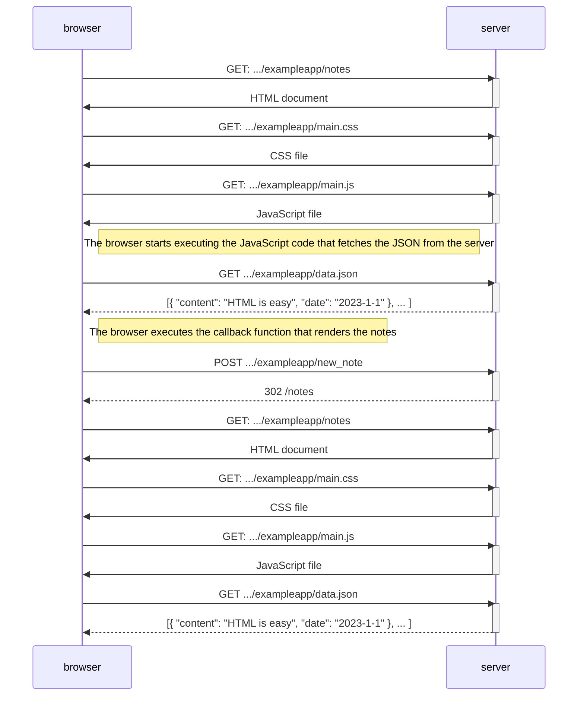

New note on Application

```mermaid
sequenceDiagram
    browser->>server: GET: .../exampleapp/notes
    activate server
    server->>browser: HTML document
    deactivate server

    browser->>server: GET: .../exampleapp/main.css
    activate server
    server->>browser: CSS file
    deactivate server

    browser->>server: GET: .../exampleapp/main.js
    activate server
    server->>browser: JavaScript file
    deactivate server

    Note right of browser: The browser starts executing the JavaScript code that fetches the JSON from the server

    browser->>server: GET .../exampleapp/data.json
    activate server
    server-->>browser: [{ "content": "HTML is easy", "date": "2023-1-1" }, ... ]
    deactivate server

    Note right of browser: The browser executes the callback function that renders the notes

    browser->>server: POST .../exampleapp/new_note
    activate server
    server-->>browser: 302 /notes
    deactivate server

    browser->>server: GET: .../exampleapp/notes
    activate server
    server->>browser: HTML document
    deactivate server

    browser->>server: GET: .../exampleapp/main.css
    activate server
    server->>browser: CSS file
    deactivate server

    browser->>server: GET: .../exampleapp/main.js
    activate server
    server->>browser: JavaScript file
    deactivate server

    browser->>server: GET .../exampleapp/data.json
    activate server
    server-->>browser: [{ "content": "HTML is easy", "date": "2023-1-1" }, ... ]
    deactivate server
```
